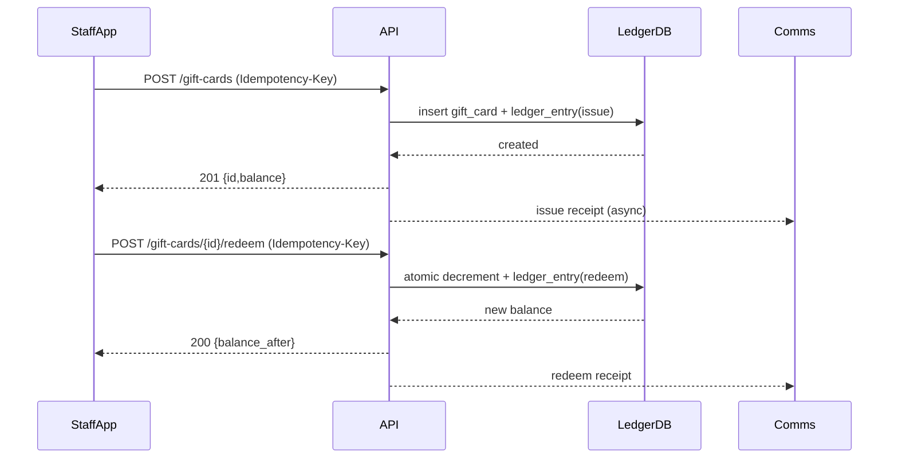
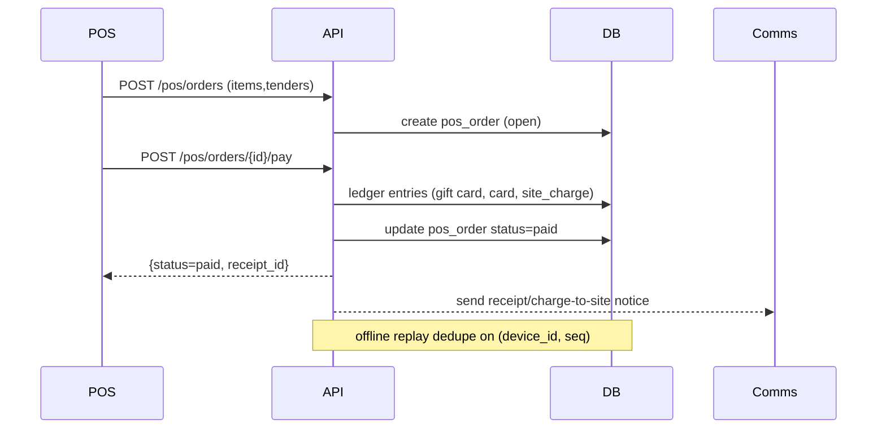

# Phase 4 — Monetization & Insights Execution

Scope: Gift cards/store credit (liability, expiry, tax), POS (charge-to-site vs pay-now; refunds/exchanges; offline parity), reporting/analytics (ADR/RevPAR/revenue/channel mix; saved reports/exports), waitlist with auto-offers (matching, throttles, comms, acceptance/expiry, audit).

## Data & API (tenant-scoped, idempotent, audited)

- **Tables (new):**
  - `gift_card`: `id` (ULID), `tenant_id`, `code` (hashed), `status` (active/void/expired), `type` (gift_card|store_credit), `issued_value`, `balance`, `currency`, `expires_at`, `taxable_load` (bool), `issued_via` (pos|web|support|import), `recipient_contact`, `metadata`, `created_by`, timestamps, `version`.
  - `ledger_entry`: `id`, `tenant_id`, `subject_type` (gift_card|folio|pos_order), `subject_id`, `entry_type` (issue|redeem|refund|void|adjust|expire|reprice), `amount`, `currency`, `balance_after`, `tax_components`, `idempotency_key`, `created_by`, timestamps; immutable rows.
  - `idempotency_key`: `tenant_id`, `key`, `request_hash`, `response_body`, `status`, `expires_at` (7d), timestamps.
  - `pos_order`: `id`, `tenant_id`, `device_id`, `session_id`, `order_no`, `status` (open/paid/refunded/partial_refund/voided), `payment_mode` (pay_now|charge_to_site), `totals` (net/tax/fees/discounts), `channel`, `customer`, `line_items[]`, `tenders[]`, `audit_ref`, timestamps.
  - `pos_offline_batch`: `tenant_id`, `device_id`, `seq`, `payload`, `status` (pending/applied/rejected), `applied_at`, `reject_reason`.
  - `waitlist_entry`: `id`, `tenant_id`, `guest`, `party`, `constraints` (dates/site types/price cap), `priority`, `status` (waiting/removed), timestamps.
  - `waitlist_offer`: `id`, `tenant_id`, `entry_id`, `inventory_ref`, `hold_expires_at`, `status` (pending/accepted/declined/expired/cancelled), `throttle_bucket`, `sent_via`, `idempotency_key`, timestamps.
  - `report_definition`: `id`, `tenant_id`, `name`, `metrics` (ADR|RevPAR|revenue|channel_mix|liability), `filters`, `timezone`, `schedule` (cron/none), `recipients`, `format` (ui|csv), timestamps.
  - `export_job`: `id`, `tenant_id`, `definition_id`, `status` (queued/running/success/failed/expired), `progress`, `storage_url`, `error`, `requested_by`, timestamps.
- **APIs (all with `Idempotency-Key`, tenant-scoped, audited):**
  - Gift value: `POST /gift-cards` (issue or store credit), `POST /gift-cards/{id}/redeem`, `POST /gift-cards/{id}/refund`, `POST /gift-cards/{id}/void`, `POST /gift-cards/{id}/adjust`, `GET /gift-cards/{id}/balance`, `POST /gift-cards/import` (bulk create).
  - POS: `POST /pos/orders` (create + tender validation), `POST /pos/orders/{id}/pay` (pay-now), `POST /pos/orders/{id}/charge-to-site`, `POST /pos/orders/{id}/refund`, `POST /pos/orders/{id}/exchange`, `POST /pos/offline-batch` (seq-based replay), `GET /pos/orders/{id}`.
  - Waitlist: `POST /waitlist` (create entry), `POST /waitlist/{id}/offers` (send), `POST /waitlist/offers/{id}/accept`, `POST /waitlist/offers/{id}/decline`, `POST /waitlist/offers/{id}/expire` (system/cron), `GET /waitlist/{id}`.
  - Reporting: `GET /reports/metrics?range=...&grouping=...` (ADR/RevPAR/revenue/channel mix/liability), `POST /reports/definitions`, `GET /reports/definitions/{id}`, `POST /reports/definitions/{id}/run` (exports), `GET /exports/{id}` (status/file).
- **Rules/behaviors:**
  - RLS/tenant scoping on all new tables; no cross-tenant ids in bodies; redact codes/PAN in logs.
  - Ledger enforced for every value movement; `balance_after` derived; no updates to ledger rows.
  - Expiry job moves `gift_card.status=expired` and appends `ledger_entry(expire)`.
  - Redeem prevents overspend via atomic decrement; split tender supports `gift_card + card + site_charge`.
  - POS offline replay dedupes on `(device_id, seq)`; rejects duplicates and stale price versions.
  - Waitlist accept is idempotent; if offer expired → 410; second accept → 409; acceptance holds inventory then confirms booking/folio.
  - Reporting rollups use ledger/booking sources with timezone-aware bucketing; saved definitions immutable except name/recipients/schedule.

## UX notes

- Staff: POS flow for pay-now vs charge-to-site; gift card issuance/redemption with balance check; refund to original tender or store credit; audit banner for adjustments; offline mode shows sync queue and last sync.
- Public: gift card redemption entry at checkout; balance lookup with CAPTCHA/throttle; waitlist offer email/SMS with CTA, countdown, and terms.
- Admin: saved reports list with statuses; export history with download + delete; liability dashboard showing issued vs redeemed vs expired.

## Comms triggers

- Gift/store credit: issue (receipt + terms), redeem (receipt), low-balance threshold, expiry notice, void, refund-to-credit, adjustment audit copy to staff.
- POS: pay-now receipt (email/SMS/print), refund/exchange receipts, charge-to-site notification to guest/contact, offline replay success/failure to staff channel.
- Waitlist: offer sent, reminder before expiry, acceptance confirmation, expiry/decline notice; bounce/complaint routed to support.
- Reporting: export ready, scheduled report failures, capacity throttling notice (503 guard).
- All comms: template IDs per tenant, audit message_id, rate limits per channel, retries with DLQ, idempotent send keyed by business action.

## Risks & edge cases

- Double-redeem/overspend under concurrency; need atomic decrement and idempotency on redeems/refunds.
- Tax timing on stored value (load taxable vs redeem taxable) by region; ensure reporting separates liability vs revenue recognition.
- Offline replay duplicates or stale pricing/tax versions; enforce `(device_id, seq)` uniqueness and price version check.
- Expiry and reinstatement; refunds to expired/zero cards must error with guidance.
- Waitlist over-offering or holds not released; ensure hold expiry job and limiter per segment/channel.
- Reporting correctness: timezone boundaries, inclusion rules for canceled/refunded stays, liability rollup equals ledger.

## Test plan (high level)

- Unit: ledger ops, idempotency keys, expiry transitions, tax calc permutations, waitlist offer lifecycle, offline dedupe helper.
- Integration: split tender with gift card + card + site_charge; refund/exchange adjusts ledger and inventory; offline batch replay dedupe; waitlist accept/decline/expire; reporting rollup vs fixtures; comms dispatch with fallbacks.
- E2E: issue + redeem + expiry; POS pay-now and charge-to-site with refunds; waitlist auto-offer → acceptance; export request → CSV matches UI totals.
- Reconciliation: ledger vs liability snapshot; report totals vs raw bookings/POS; concurrency stress for double-spend and replay duplicates.

## Dependencies / asks

- Tax policy per region (load taxable vs redeem taxable), expiry policy by locale, rounding rules.
- Comms provider creds and sender domains; template approval (staff/public).
- Pricing/tax service availability and versioning; inventory hold semantics for offers; auth/roles for staff devices.
- POS hardware limits (reader/printer, storage) and offline storage caps.

## Execution plan & acceptance criteria

- Domain schema + API contracts published; RLS + audit on all new tables; Idempotency-Key enforced.
- Gift/store credit: issue/redeem/void/adjust/refund endpoints idempotent; expiry honored; ledger immutable; liability rollup matches ledger; split tender prevents overspend.
- POS: pay-now and charge-to-site flows complete with taxes/discounts; refunds/exchanges adjust ledger/inventory; offline replay deduped; staff auth required.
- Waitlist: matching + throttles; offers hold inventory; accept idempotent; expiry releases holds; full audit of lifecycle; comms templated.
- Reporting: ADR/RevPAR/revenue/channel mix and liability dashboards match exports; saved reports CRUD; exports have status and SLA; capacity guard returns 503 on overload.
- Comms: triggers wired with audit and rate limits; retries with DLQ; sandbox verified.

## Sequence diagrams (text)

### Gift card issue/redeem (idempotent)

- Client → API: `POST /gift-cards` with Idempotency-Key
- API → Idempotency store: fetch/lock key
- API → DB: insert `gift_card` + `ledger_entry(issue)`
- DB → API: balances
- API → Idempotency store: persist response
- Client → API: `POST /gift-cards/{id}/redeem` (Idempotency-Key)
- API → Idempotency store: fetch/lock key
- API → DB: atomic decrement balance; insert `ledger_entry(redeem)`
- DB → API: new balance
- API → Idempotency store: persist response
- API → Comms: send receipt (async)

### POS pay-now + charge-to-site

- Staff app → API: `POST /pos/orders` (items, tenders)
- API: price/tax calc; validate split tender sum
- API → DB: create `pos_order (open)`
- Staff app → API: `POST /pos/orders/{id}/pay`
- API: authorize/process card; decrement gift card (optional); add ledger rows
- API → DB: `pos_order` status paid; folio link (if charge-to-site) or receipt id
- API → Comms: receipt/charge-to-site notice
- Refund/exchange: `POST /pos/orders/{id}/refund|exchange` → ledger adjustments, inventory delta, receipt
- Offline: device batches with `(device_id, seq)` → API validates seq, applies same flow, rejects duplicates/stale price version.

### Waitlist offer/accept

- Matcher → API: `POST /waitlist/{id}/offers` (inventory, hold_expires_at)
- API → DB: `waitlist_offer` pending + inventory hold
- API → Comms: send offer template
- Guest → API: `POST /waitlist/offers/{id}/accept` (Idempotency-Key)
- API: check status/expiry/hold; confirm booking/folio; mark offer accepted; release hold on others
- API → Comms: confirmation; audit log
- Expiry job: marks pending → expired, releases holds, sends expiry notice.

### Reporting export

- User → API: `POST /reports/definitions/{id}/run`
- API → DB: `export_job` queued
- Worker: fetches job, runs query/rollup, writes file, updates status/progress
- API → User: `GET /exports/{id}` returns status/url
- Comms: send "export ready" or failure notice.

## Service-area breakdown (for grooming)

- **Payments/Value (Gift & Store Credit):** Tables `gift_card`, `ledger_entry`, idempotency keys; issue/redeem/adjust/void/refund APIs; expiry job; split tender guardrails; liability rollup; comms hooks for issue/redeem/expiry/void.
- **POS:** `pos_order`, `pos_offline_batch`; pay-now vs charge-to-site flows; refunds/exchanges; split tender validation; device/session auth; offline dedupe `(device_id, seq)`; receipts (print/email/SMS); inventory/tax service integration.
- **Waitlist & Offers:** `waitlist_entry`, `waitlist_offer`; matcher rules and throttles; inventory holds with expiry; accept/decline/expire endpoints idempotent; audit; comms templates (offer, reminder, outcome).
- **Reporting & Exports:** `report_definition`, `export_job`; metrics ADR/RevPAR/revenue/channel mix/liability; saved report CRUD; export worker with status/progress; capacity guard (503) and SLA; access control per tenant; reconciliation views.
- **Comms & Observability:** Template registry per tenant; message audit ids; rate limits; DLQ + retries; alerts for redeem failure spike, offline backlog, offer lag, report failures; synthetic checks for redeem/POS/offer/export.

## API payload sketches (concise)

- `POST /gift-cards` issue/store credit  
  Request: `{ type, amount, currency, expires_at?, taxable_load?, recipient_contact?, issued_via, metadata?, Idempotency-Key }`  
  Response: `{ id, masked_code?, balance, currency, expires_at, status }`
- `POST /gift-cards/{id}/redeem`  
  Request: `{ amount, currency, reference (folio|order), Idempotency-Key }`  
  Response: `{ balance_after, ledger_entry_id }` (409 on replay with different params)
- `POST /gift-cards/{id}/refund`  
  Request: `{ amount, reason, original_reference?, Idempotency-Key }`  
  Response: `{ balance_after, ledger_entry_id }`
- `POST /pos/orders`  
  Request: `{ items[], taxes_hint?, discounts?, payment_mode (pay_now|charge_to_site), tenders[], customer?, device_id?, session_id?, Idempotency-Key }`  
  Response: `{ id, status=open, totals, validation_errors? }`
- `POST /pos/orders/{id}/pay`  
  Request: `{ tenders[], Idempotency-Key }` (gift card tender includes `gift_card_id`, `amount`)  
  Response: `{ status=paid, receipt_id, ledger_entries[] }`
- `POST /pos/offline-batch`  
  Request: `{ device_id, seq, orders: [...] }`  
  Response: `{ applied=true|false, duplicate=true|false, reject_reason? }`
- `POST /waitlist/{id}/offers`  
  Request: `{ inventory_ref, hold_expires_at, channel?, throttle_bucket?, template_id? }`  
  Response: `{ offer_id, status=pending }`
- `POST /waitlist/offers/{id}/accept`  
  Request: `{ Idempotency-Key, payment_mode?, tender? }`  
  Response: `{ status=accepted, booking_id, folio_id }` (409 on second accept; 410 if expired)
- `GET /reports/metrics`  
  Query: `range, granularity, metrics[], grouping, filters..., timezone`  
  Response: `{ series[], totals, generated_at }`
- `POST /reports/definitions`  
  Request: `{ name, metrics[], filters, timezone, schedule?, recipients?, format }`  
  Response: `{ id, status }`
- `POST /reports/definitions/{id}/run`  
  Request: `{ format?, recipients_override? }`  
  Response: `{ export_job_id }`

## Acceptance criteria (succinct, per-surface)

- Gift/store credit: atomic decrement prevents overspend; idempotent issue/redeem/refund; expiry applied; ledger immutable; liability rollup = sum(balances); logs redacted.
- POS: split tender sums validated; charge-to-site posts folio with audit; refunds/exchanges adjust ledger and inventory; offline seq dedupe rejects duplicates; receipts delivered.
- Waitlist: throttles enforced; holds placed/released; accept/decline/expire audited; idempotent accept; comms templated; matcher lag within SLA.
- Reporting/exports: ADR/RevPAR/revenue/channel mix totals consistent UI vs CSV; saved reports retrievable; exports have status and SLA; capacity guard returns 503 under load.
- Comms/obs: idempotent sends with message_id; rate limits; DLQ monitored; alerts and synthetics active for redeem/POS/offer/export; PII redaction verified.

## Mermaid sketches (read-only text)





```mermaid
sequenceDiagram
  participant Matcher
  participant API
  participant DB
  participant Guest
  participant Comms
  Matcher->>API: POST /waitlist/{id}/offers
  API->>DB: insert waitlist_offer + hold
  API-->>Comms: send offer
  Guest->>API: POST /waitlist/offers/{id}/accept
  API->>DB: validate hold/status; create booking/folio; mark accepted
  API-->>Guest: 200 accepted
  API-->>Comms: confirmation
  Note over API,DB: expiry job marks expired, releases hold
```

## Example payloads (JSON)

- Issue gift card/store credit

```json
POST /gift-cards
Headers: { "Idempotency-Key": "abc-123" }
Body: {
  "type": "gift_card",
  "amount": 10000,
  "currency": "USD",
  "expires_at": "2026-12-31T23:59:59Z",
  "taxable_load": false,
  "issued_via": "pos",
  "recipient_contact": { "email": "guest@example.com" },
  "metadata": { "note": "holiday promo" }
}
Response: { "id": "gft_...", "balance": 10000, "currency": "USD", "status": "active" }
```

- Redeem gift card

```json
POST /gift-cards/gft_123/redeem
Headers: { "Idempotency-Key": "abc-124" }
Body: {
  "amount": 4500,
  "currency": "USD",
  "reference": { "type": "pos_order", "id": "pos_789" }
}
Response: { "balance_after": 5500, "ledger_entry_id": "led_..." }
```

- POS pay-now with split tender

```json
POST /pos/orders
Headers: { "Idempotency-Key": "abc-200" }
Body: {
  "items": [
    { "sku": "firewood", "qty": 2, "price": 1200 },
    { "sku": "kayak", "qty": 1, "price": 5000 }
  ],
  "payment_mode": "pay_now",
  "tenders": [
    { "type": "gift_card", "gift_card_id": "gft_123", "amount": 3000 },
    { "type": "card", "amount": 4400, "card_token": "tok_visa" }
  ],
  "device_id": "dev-pos-01",
  "session_id": "sess-9"
}
Response: { "id": "pos_789", "status": "paid", "totals": { "net": 6200, "tax": 1200 } }
```

- Waitlist offer accept

```json
POST /waitlist/offers/wlo_456/accept
Headers: { "Idempotency-Key": "abc-300" }
Body: {
  "payment_mode": "pay_now",
  "tender": { "type": "card", "card_token": "tok_mastercard" }
}
Response: { "status": "accepted", "booking_id": "bkg_555", "folio_id": "fol_777" }
```

- Run export

```json
POST /reports/definitions/rpt_123/run
Body: { "format": "csv", "recipients_override": ["finops@example.com"] }
Response: { "export_job_id": "exp_999" }
```

- POS refund / exchange

```json
POST /pos/orders/pos_789/refund
Headers: { "Idempotency-Key": "abc-400" }
Body: {
  "lines": [
    { "order_line_id": "line1", "qty": 1, "reason": "damaged" }
  ],
  "tenders": [
    { "type": "gift_card", "gift_card_id": "gft_123", "amount": 1200 },
    { "type": "card", "amount": 800, "original_payment_id": "pay_001" }
  ]
}
Response: { "status": "refunded", "ledger_entries": ["led_..."] }
```

```json
POST /pos/orders/pos_789/exchange
Headers: { "Idempotency-Key": "abc-401" }
Body: {
  "return_lines": [
    { "order_line_id": "line2", "qty": 1 }
  ],
  "new_items": [
    { "sku": "kayak_paddle", "qty": 1, "price": 3500 }
  ],
  "tenders": [
    { "type": "card", "amount": 1500, "card_token": "tok_visa" }
  ]
}
Response: { "status": "exchanged", "net_delta": 1500, "ledger_entries": ["led_..."] }
```

- Charge-to-site receipt/notice

```json
POST /pos/orders/pos_900/charge-to-site
Headers: { "Idempotency-Key": "abc-450" }
Body: {
  "folio_id": "fol_123",
  "guest_contact": { "email": "camper@example.com" }
}
Response: { "status": "charged", "folio_id": "fol_123", "receipt_id": "rcp_900" }
```

- Offline replay batch (dedupe)

```json
POST /pos/offline-batch
Headers: { "Idempotency-Key": "abc-500" }
Body: {
  "device_id": "dev-pos-01",
  "seq": 42,
  "orders": [
    {
      "temp_id": "tmp-1",
      "items": [{ "sku": "firewood", "qty": 1, "price": 1200 }],
      "payment_mode": "pay_now",
      "tenders": [{ "type": "card", "amount": 1300, "card_token": "tok_offline" }],
      "recorded_at": "2025-12-10T05:00:00Z"
    }
  ]
}
Response: { "applied": true, "duplicate": false }
```

## Comms template variables (reference)

- Gift/store credit: `{{guest_name}}`, `{{card_last4_or_mask}}`, `{{amount}}`, `{{balance_after}}`, `{{currency}}`, `{{expires_at}}`, `{{terms_url}}`, `{{support_contact}}`, `{{txn_id}}`.
- POS receipts/refunds: `{{order_id}}`, `{{folio_id}}`, `{{items_table}}`, `{{net}}`, `{{tax}}`, `{{total}}`, `{{tenders_breakdown}}`, `{{refund_amount}}`, `{{device_id}}`, `{{location}}`, `{{receipt_url}}`.
- Waitlist: `{{property_name}}`, `{{dates}}`, `{{site_type}}`, `{{price}}`, `{{hold_expires_at}}`, `{{offer_accept_url}}`, `{{terms_url}}`, `{{support_contact}}`.
- Reports/exports: `{{report_name}}`, `{{date_range}}`, `{{timezone}}`, `{{download_url}}`, `{{status}}`, `{{error_message}}`.
- All: `{{message_id}}`, `{{tenant_name}}`, `{{unsubscribe/manage_prefs_url}}` where required.

## SLA and guardrails (targets)

- Waitlist matcher lag: p95 < 30s staging; alert at >60s.
- Offer expiry reminders: send T-15m (configurable), expiry sweep every 5m.
- Redeem/posting latency: p95 < 400ms; alert at >700ms sustained 5m.
- Export job SLA: small (<50k rows) < 2m; large (<1M rows) < 10m; capacity guard returns 503 + retry-after when queue > threshold.
- Offline replay: backlog alert when pending batches > 50 or oldest > 10m.
- Comms delivery: bounce/complaint alerts; retry with backoff; DLQ monitored; rate limits per channel (e.g., 5/s per tenant per channel).

## Error codes (concise)

- 400: validation (missing fields, tender sum mismatch, invalid tax config, stale price version).
- 401/403: unauth/forbidden (device/session not authorized, tenant mismatch).
- 404: resource not found (gift card id/code, order, offer).
- 409: idempotency replay with different params; double-redeem; duplicate offline seq; second waitlist accept.
- 410: expired gift card; expired waitlist offer/hold.
- 422: business rule violation (insufficient balance, offer without hold, refund to expired card).
- 429: throttled (balance lookup/apply, offer send).
- 500/503: capacity guard (reports/export), downstream unavailability; include `retry_after` when possible.

## Alert & synthetic checklist (staging)

- Redeem synthetic: create + redeem card; expect 200 then 409 on repeat; alert on failure spike.
- POS synthetic: split tender (gift + card); ensure ledger once; alert on tender mismatch or double-debit.
- Offer synthetic: send offer; accept once (200); second = 409; expired = 410; alert on matcher lag.
- Report synthetic: request export; verify status success; capacity guard returns 503 under load; alert on failures.
- Offline backlog: inject pending batches > threshold; expect alert.
- Comms: trigger bounce/complaint; ensure alert and DLQ count increments.

## Tax edge cases (matrix)

- Stored value taxation:
  - Jurisdictions where load is taxable (VAT-like): collect tax on issuance; revenue recognition deferred; liability includes tax component; refund returns tax proportionally.
  - Jurisdictions where redemption is taxable (sales-tax): no tax on load; tax calculated at redeem per item jurisdiction; ensure price versioning for offline replay.
- Cross-currency: reject if currency mismatch; or require FX table + spread; log if unsupported.
- Tips/gratuity: exclude from taxable base where required; ensure POS hints taxability per line.
- Discounts: apply pre-tax; ensure ledger entry records net/tax split.
- Expiry and breakage: if breakage recognized, mark ledger entry `reprice/breakage` with region-specific rules; otherwise keep liability until redeemed/void.
- Refund to expired card: 410 with guidance; allow refund to new store credit if policy permits (new card issuance).

## RLS / access control notes

- All new tables keyed by `tenant_id`; RLS ensures `current_tenant = tenant_id`.
- Staff POS/device: require device token + staff role; restrict `pos_offline_batch` to registered devices.
- Public endpoints: gift balance lookup throttled + CAPTCHA; waitlist accept scoped to offer token/id.
- Saved reports/exports: enforce ownership per tenant; URLs signed and time-bound.
- Audit: write-only append logs; include actor (user/device/service), request id, message id for comms.

## Inventory hold semantics (offers/POS)

- Holds carry `hold_expires_at`, `inventory_ref`, `price_version`, `tax_version`.
- On offer send: place hold; fail if conflicting hold or inventory unavailable.
- On accept: validate hold not expired; confirm inventory; convert hold to booking/folio; release other holds for same entry.
- On decline/expiry: release hold; audit action; optionally send next offer per throttle rules.
- POS holds (if used for charge-to-site reservations): ensure same versions as pricing/tax; reconcile on replay.

## Matcher throttles (waitlist)

- Throttle buckets by segment/channel (e.g., property-date-range-site-type).
- Limit outstanding offers per entry (e.g., 1 active at a time) and per bucket per interval (e.g., 20/min).
- Respect do-not-disturb windows; pause offers during blackout.
- Ensure matcher lag alerts if queue depth/latency exceeds SLA; support manual resend with idempotency key.

## DLQ / retry policy (comms + jobs)

- Comms send: retry 3x with backoff (e.g., 1s, 10s, 60s); move to DLQ with reason and message_id; surface in admin; optional auto-replay with cap.
- Export jobs: retry failed chunks up to 2x; mark job failed with error; alert on failure rate; allow user rerun.
- Offer send: if comms fails, keep offer pending; retry per comms policy; do not auto-expire solely on comms failure; log for support.
- Offline batch: if apply fails, mark `rejected` with reason; require operator action to resend after fix; duplicates rejected by `(device_id, seq)`.
- Idempotency store: TTL (e.g., 7d); returning stored response for completed keys; in-progress keys block concurrent work.

## Rate limits (defaults; per-tenant unless noted)

- Gift card balance lookup/apply: 5 r/s, burst 10.
- Gift card issuance/redeem/refund: 2 r/s, burst 5.
- POS pay/charge-to-site: 5 r/s, burst 10 (per device_id may be stricter).
- Offline batch ingest: 1 r/s per device_id, burst 2.
- Waitlist offer send: 1 r/s per throttle bucket; global 20/min cap per tenant to avoid over-offer.
- Waitlist accept: 3 r/s, burst 5; idempotent accepts return stored response.
- Reports/exports run: 1 concurrent job per tenant; queue cap (e.g., 5); overflow returns 503 with retry-after.
- Comms send: 5 r/s per channel; provider-specific limits respected; backoff on 429/5xx.

## Ops runbook snippets (succinct)

- **Redeem spike/409s:** check idempotency collisions; verify ledger for double spend; raise rate limit if legit spike; inspect logs for code/PAN redaction.
- **Offline backlog:** check pending `pos_offline_batch`; confirm device clock skew and price/tax version; reject duplicates; notify staff to resync.
- **Matcher lag:** inspect queue depth; scale workers; pause new offer generation if >60s lag; communicate ETA.
- **Export failures:** review job error; rerun; if capacity guard (503), raise queue cap temporarily; ensure storage URL signing valid.
- **Comms DLQ:** triage bounce/complaint; replay after fix; verify sender domain/SPF/DKIM; watch rate limits.
