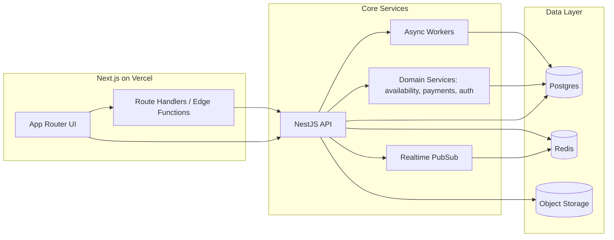

# Best End-State Architecture (Keepr)

This document defines the target architecture for the best long-term product outcome. The goal is maximum booking correctness, operational reliability, and performance for guests and staff. It is intentionally right-tool, not vendor-pure.

## Goals

- Zero double-booking under contention.
- Always-correct financial ledger and payout reconciliation.
- Fast guest discovery and booking experiences globally.
- Reliable operations for staff (even during spikes).
- Clear observability and audit trails for every action.

## Principles

- Strong consistency for inventory, reservations, and ledger writes.
- Idempotent mutations everywhere (booking, payment, check-in/out).
- Async for slow or external work (email, OTA sync, reporting).
- Edge for read-heavy, public, and cacheable surfaces.
- Decompose high-risk domain logic (availability, payments) into isolated services.

## Target Runtime Architecture

- **Vercel (Edge + Server)**: Next.js UI, server actions, and route handlers for read-heavy or cacheable surfaces.
- **Core API (long-running service)**: NestJS for transactional operations and internal orchestration.
- **Domain Services (long-running)**: Rust services for availability, auth, and payment-critical logic.
- **Async Workers**: queue processors for notifications, sync jobs, and reconciliations.
- **Realtime**: managed websocket/pubsub layer for staff dashboards and live updates.

## Data Architecture

- **Primary DB**: Postgres as the single-writer source of truth.
- **Cache**: Redis for hot reads, locks, and short-lived state.
- **Object Storage**: uploads, reports, exports.
- **Outbox pattern**: capture domain events to guarantee at-least-once async processing.

## Observability

- Correlated tracing across Web, API, Rust, and workers (OTel + Sentry).
- SLO targets are aligned with `docs/observability-slos.md` and enforced via CI budgets and runtime alerts.
- Full audit trail for reservations, payments, and staff actions.

## Diagram

## Component Responsibilities

- **Next.js (Vercel)**
  - Public marketing and discovery pages (ISR / edge cache).
  - Guest booking UI with fast quote endpoints.
  - Staff UI shell with live updates via realtime.

- **NestJS API (Core)**
  - Reservation lifecycle, pricing, payments, and policies.
  - Auth, RBAC, audit logging, and admin operations.
  - Orchestrates Rust services for critical logic.

- **Rust Services (Core)**
  - Availability engine with strict correctness.
  - Payment-critical operations and ledger guardrails.
  - Auth and security primitives where needed.

- **Async Workers**
  - Email/SMS, OTA sync, exports, reporting.
  - Idempotent job execution with retry/backoff.

- **Realtime Service**
  - Live ops dashboard updates and staff messaging.
  - Presence and activity indicators.

## SLO Targets (Product-Level)

- Guest search/quote p95: <= 600ms.
- Reservation mutation p95: <= 800ms.
- Payment capture success: >= 99.5%.
- Ops dashboard availability: >= 99.9%.
- Async job failure rate: <= 2%.

## Risks and Mitigations

- **Concurrency and double-booking**: strict transactional holds, lock timeouts, and idempotency keys.
- **Provider outages**: fallbacks for email/SMS and retry queues for payments.
- **OTA sync drift**: periodic reconciliation jobs with conflict reporting.
- **Latency spikes**: edge caching for read paths and DB read replicas.

## Why Not "Pure Vercel"

Pure Vercel does not support long-running services, websocket servers, or Rust services. A right-tool architecture yields better reliability and correctness for bookings and payments, which is the product priority.
